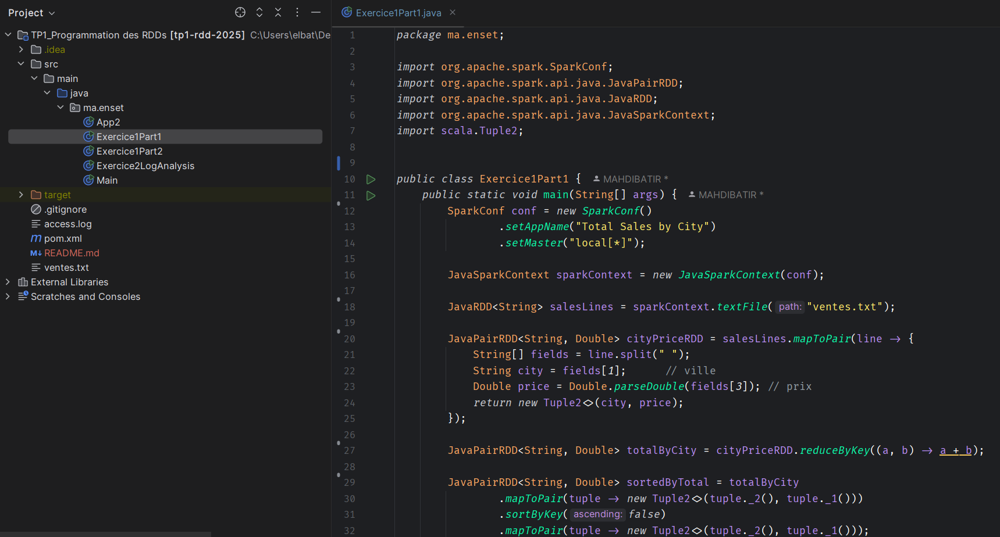
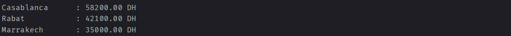
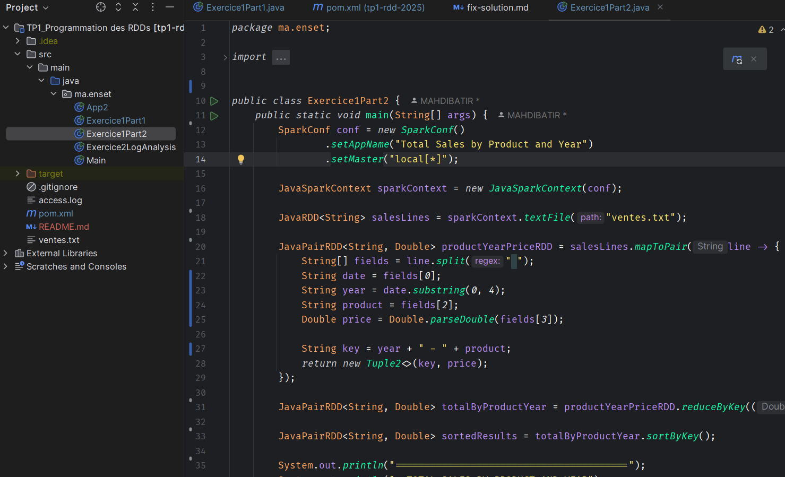
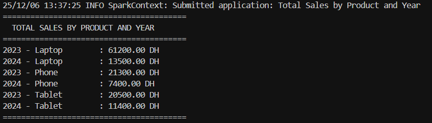
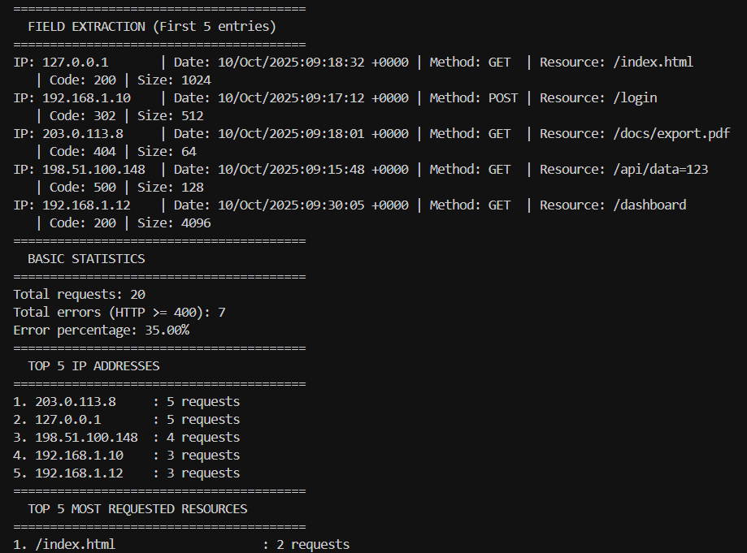

# TP1: Programmation des RDDs avec Apache Spark

**Auteur:** MAHDI BATIR  
**Date:** Décembre 2025  
**Cours:** Big Data - Programmation des RDDs

---

## 📋 Exercice 1: Analyse des ventes

### Partie 1: Total des ventes par ville

**Code:**



**Résultats:**



---

### Partie 2: Total des ventes par produit et année

**Code:**



**Résultats:**



---

## 📋 Exercice 2: Analyse de logs Apache

**Résultats:**



---

## 🚀 Technologies utilisées

- **Java** 21
- **Apache Spark** 4.0.1
- **Maven** - Gestion des dépendances
- **IntelliJ IDEA** - IDE

---

## 📦 Installation et Exécution

### Cloner le repository
```bash
git clone https://github.com/MAHDIBATIR/Programmation-des-RDDs.git
cd Programmation-des-RDDs
```

### Compiler le projet
```bash
mvn clean compile
```

### Exécuter dans IntelliJ IDEA
1. Ouvrir le projet dans IntelliJ IDEA
2. Naviguer vers la classe Java souhaitée (`Exercice1Part1`, `Exercice1Part2`, ou `Exercice2LogAnalysis`)
3. Clic droit → Run

---

**© 2025 - Big Data TP1**
